# SSINet

SSINet is a self-supervised interpretable framework, which can discover interpretable features to enable easy understanding of RL agents even for non-experts. Specifically, SSINet can be used to produce fine-grained attention masks for highlighting task-relevant information, which constitutes most evidence for the agent’s decisions. This implementation is based on the paper [Self-Supervised Discovering of Interpretable Features for Reinforcement Learning](https://arxiv.org/abs/2003.07069).

If you use this codebase for your research, please cite the paper:

```
@article{shi2020self,
  title={Self-Supervised Discovering of Interpretable Features for Reinforcement Learning},
  author={Shi, Wenjie and Huang, Gao and Song, Shiji and Wang, Zhuoyuan and Lin Tingyu and Wu, Cheng},
  journal={arXiv preprint arXiv:2003.07069},
  year={2020}
}
```


## Getting Started

The recommended way to set up these experiments is via a virtualenv.

```
sudo apt-get install python-pip
python -m pip install --user virtualenv
python -m virtualenv ~/env
source ~/env/bin/activate
```

Then install the project dependencies with the following command:

```
pip install -r requirements.txt
```

### Gym-Duckietown Installation

Our experiments are mainly performed on the [Gym-Duckietown](https://github.com/duckietown/gym-duckietown) environment, which is a self-driving car simulator environment for OpenAI Gym. It places your agent, a Duckiebot, inside of an instance of a Duckietown: a loop of roads with turns, intersections, obstacles, Duckie pedestrians, and other Duckiebots.

[Download](https://github.com/duckietown/gym-duckietown) and install all the dependencies with `pip3`:

```
git clone https://github.com/duckietown/gym-duckietown.git
cd gym-duckietown
pip3 install -e .
```

After installation, we suggest to replace the original file `<installation_path>/gym_duckietown/simulator.py` with [our revised simulator file](https://github.com/shiwj16/SSINet/envs/gym_duckietown/simulator.py) to avoid NaNs and simulation logs. Please note that if you want to reproduce our results on different maps, you should add [our customized map files](https://github.com/shiwj16/SSINet/envs/gym_duckietown/maps) to the folder `<installation_path>/gym_duckietown/maps`.

### Examples

Our training procedure includes two stages. While the first stage aims to pretrain the RL agent to be interprested, the second stage trains the attention mask to highlight task-relevant information, which constitutes most evidence for the agent’s decisions.

1. To pretrain the agent

    This stage pretrains the RL agent to obtain an expert policy, which is used to generate state-action pairs for training SSINet in the second stage.

    For Duckietown:
    ```
    python pretrain_ppo.py \
      --env_name "duckietown" \
      --map_name "loop_empty" \
      --spec_init \
      --batch_size 4 \
      --lr 0.00015 \
      --lr_decay \
      --actor_net_type "unet" \
      --net_layers 4
    ```
    ```
    python pretrain_sac.py \
      --env_name "duckietown" \
      --map_name "loop_empty" \
      --spec_init \
      --batch_size 128 \
      --alpha 0.05 \
      --actor_net_type "unet" \
      --net_layers 4 
    ```
    ```
    python pretrain_td3.py \
      --env_name "duckietown" \
      --map_name "loop_corner" \
      --spec_init \
      --batch_size 32 \
      --actor_net_type "unet" \
      --net_layers 4
    ```

    For Atari:
    ```
    python pretrain_ppo_atari.py \
      --env_name "atari" \
      --task_name "EnduroNoFrameskip-v0" \
      --seed 0 \
      --spec_init \
      --batch_size 4 \
      --lr 0.00025 \
      --lr_decay \
      --actor_net_type "unet" \
      --net_layers 4
    ```

2. To learn the attention mask

    This stage aims to learn interpretable attention masks for explaining the agent’s behavior.

    For Duckietown:
    ```
    python train_mask.py \
      --env_name "duckietown" \
      --map_name "loop_empty" \
      --spec_init \
      --reg_scale 0.02 \
      --dataset_size 50000 \
      --actor_net_type "unet" \
      --net_layers 4 \
      --model_dir "<path to the pretrained model>"
    ```

    For Atari:
    ```
    python train_mask_atari.py \
      --env_name "atari" \
      --task_name "EnduroNoFrameskip-v0" \
      --spec_init \
      --reg_scale 0.005 \
      --actor_net_type "unet" \
      --net_layers 4 \
      --model_dir "<path to the pretrained model>"
    ```

3. To simulate the resulting policies

    Finally, you can visualize the attention mask using:

    ```
    python render.py \
      --env_name "duckietown" \
      --map_name "loop_empty" \
      --seed 0 \
      --spec_init \
      --actor_net_type "unet" \
      --net_layers 4 \
      --model_dir "<path to the trained models>"
    ```

This repository includes a pretrained model and a trained mask model in the [trained_models](https://github.com/shiwj16/SSINet/trained_models) directory. These models use an U-Net actor architecture with `net_layers = 4`, and the pretrained model is trained using PPO algorithm. You can use them directly to reproduce our main experimental results or for further exploration.


## Resutls

In general, RL agents may exhibit different performance even on simple tasks. To explain why the agent performs well or badly, SSINet is implemented with different RL algorithms ([PPO](https://arxiv.org/abs/1707.06347), [SAC](https://arxiv.org/abs/1801.01290) and [TD3](https://arxiv.org/abs/1802.09477)) and actor architectures ([U-Net](https://arxiv.org/abs/1505.04597), [RefineNet](https://arxiv.org/abs/1611.06612), [FC-DenseNet](https://arxiv.org/abs/1611.09326) and [DeepLab-v3](https://arxiv.org/abs/1706.05587)). Please note that RefineNet-1 and RefineNet-2 are exactly the same except for utilizing ResNet and MobileNet as the backbone network respectively.

- Different RL algorithms with the same actor architecture (U-Net)

<p align="center">
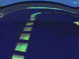 
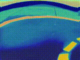 
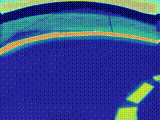 <br>
<div align="center">
PPO &emsp;&emsp;&emsp;&emsp;&emsp;&emsp;&emsp;&emsp;&emsp;&emsp;&emsp;
SAC &emsp;&emsp;&emsp;&emsp;&emsp;&emsp;&emsp;&emsp;&emsp;&emsp;&emsp;
TD3
</div>
</p>

- Different actor architectures with the same RL algorithm (PPO)

<p align="center">
 
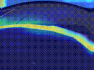 
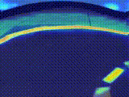 
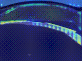 
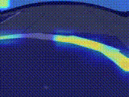 <br>
<div align="center">
&ensp;&ensp;&ensp;&ensp;&ensp;&ensp;
U-Net &emsp;&emsp;&emsp;&emsp;&emsp;&ensp;&ensp;
RefineNet-1 &emsp;&emsp;&emsp;&emsp;&emsp;
RefineNet-2 &emsp;&emsp;&emsp;&emsp;
FC-DenseNet &emsp;&emsp;&emsp;&emsp;
DeepLab-v3 &emsp;&emsp;
</div>
</p>

To evaluate the generalization capability, the agent trained on the `loop_empty` map is tested on all the maps.

<p align="center">
 
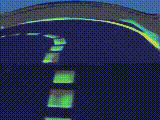 
 
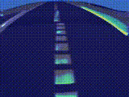 
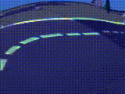 <br>
<div align="center">
&ensp;&ensp;&ensp;&ensp;
loop_empty  &emsp;&emsp;&emsp;&emsp;&ensp;
loop_corner &emsp;&emsp;&emsp;&emsp;&ensp;
loop_U_turn &emsp;&emsp;&emsp;&emsp;&ensp;
loop_S_turn &emsp;&emsp;&emsp;&emsp;&ensp;
zigzag_floor &emsp;&emsp;
</div>
</p>

<p align="center">
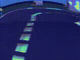 
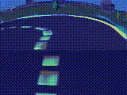 
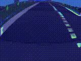 
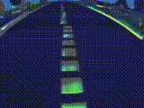 
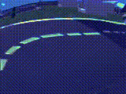 <br>
<div align="center">
&ensp;&ensp;&ensp;&ensp;
loop_empty_fill  &emsp;&emsp;&emsp;
loop_corner_fill &emsp;&emsp;&emsp;
loop_U_turn_fill &emsp;&emsp;&emsp;
loop_S_turn_fill &emsp;&emsp;&emsp;
zigzag_floor_fill &emsp;&emsp;
</div>
</p>
